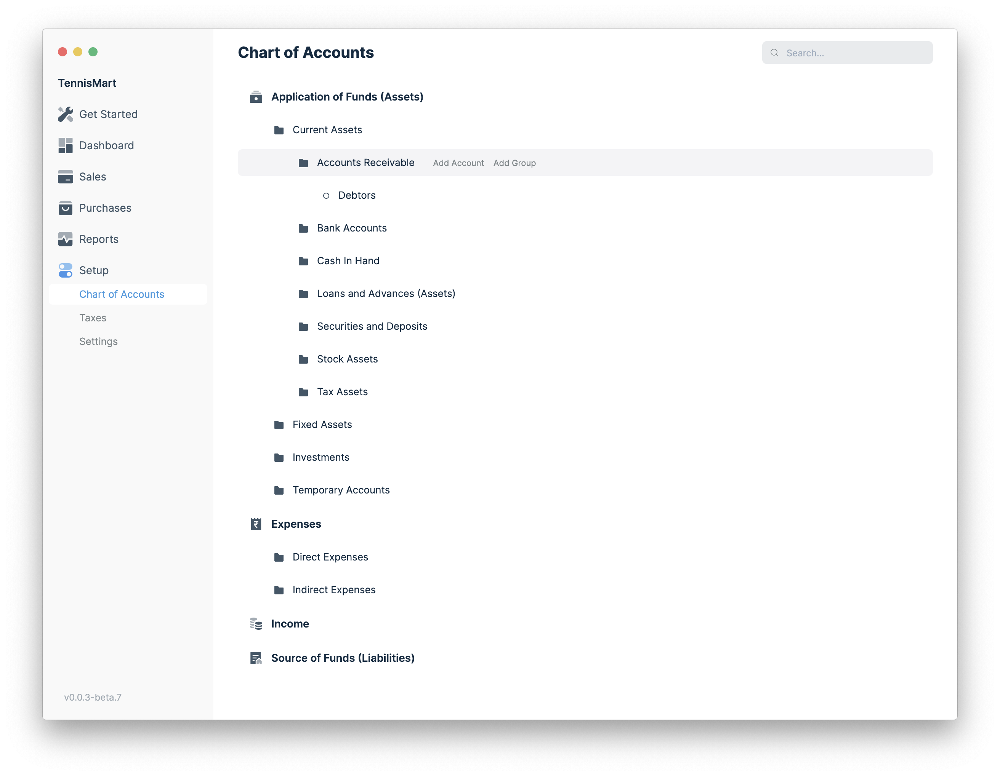

## Navigate to Chart of Accounts

To navigate to Chart of Accounts, click on Setup then Chart of Accounts in the
sidebar.

The Chart Of Accounts is displayed in a Tree format according to the
Parent-Child relationship among the accounts. You can add/remove any Accounts as
you like.

## How to add an account?

1. Browse to any node in the Chart of Accounts under which you want to create
   the account.
1. Click on Add Account which is visible when you hover on the account.
1. Enter the name of the new account.
1. Press Enter.

## How to add a group account?

Follow the steps mentioned previously but instead of clicking on Add Account,
click on Add Group.
