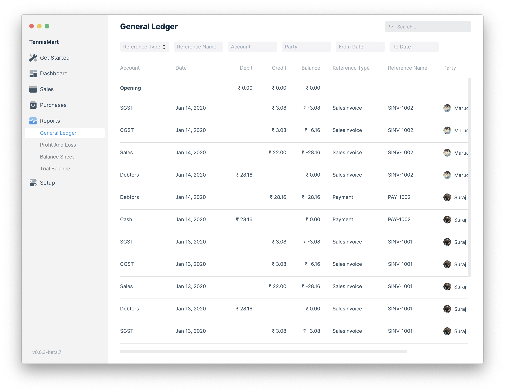

The report is based on Ledger Entries created from each accounting transaction.
It can be filtered by filters like Account, Party, and date range. This helps
you to get a full update for all entries posted in a period against any account.

To view this report, go to **Reports** > **General Ledger**.

