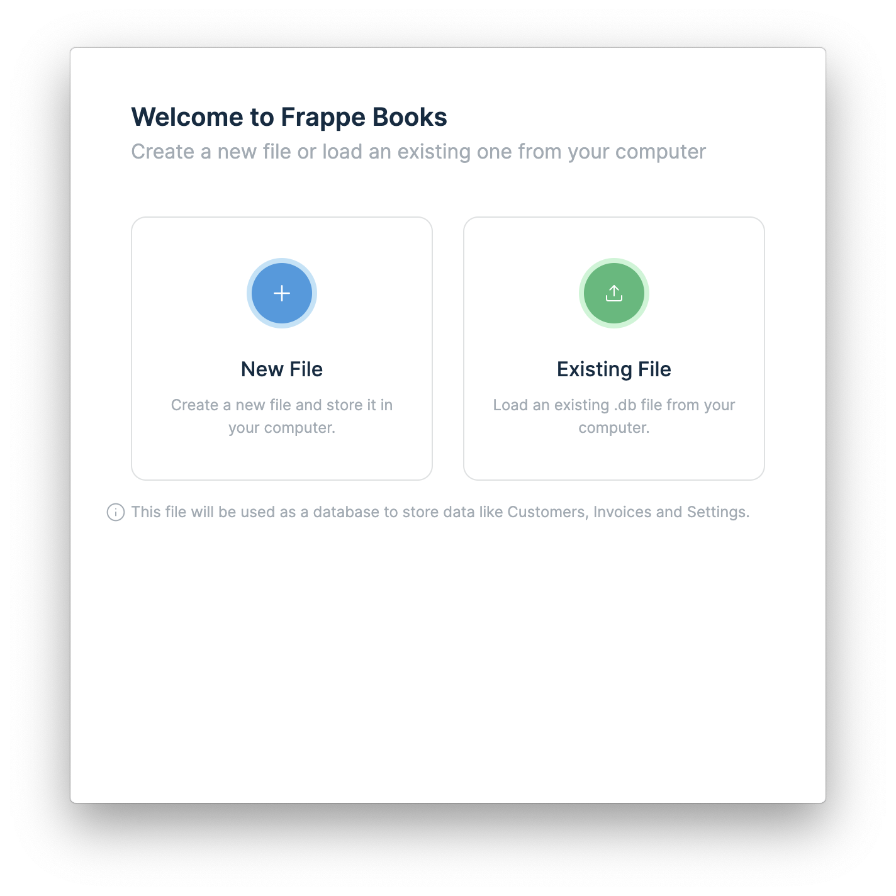
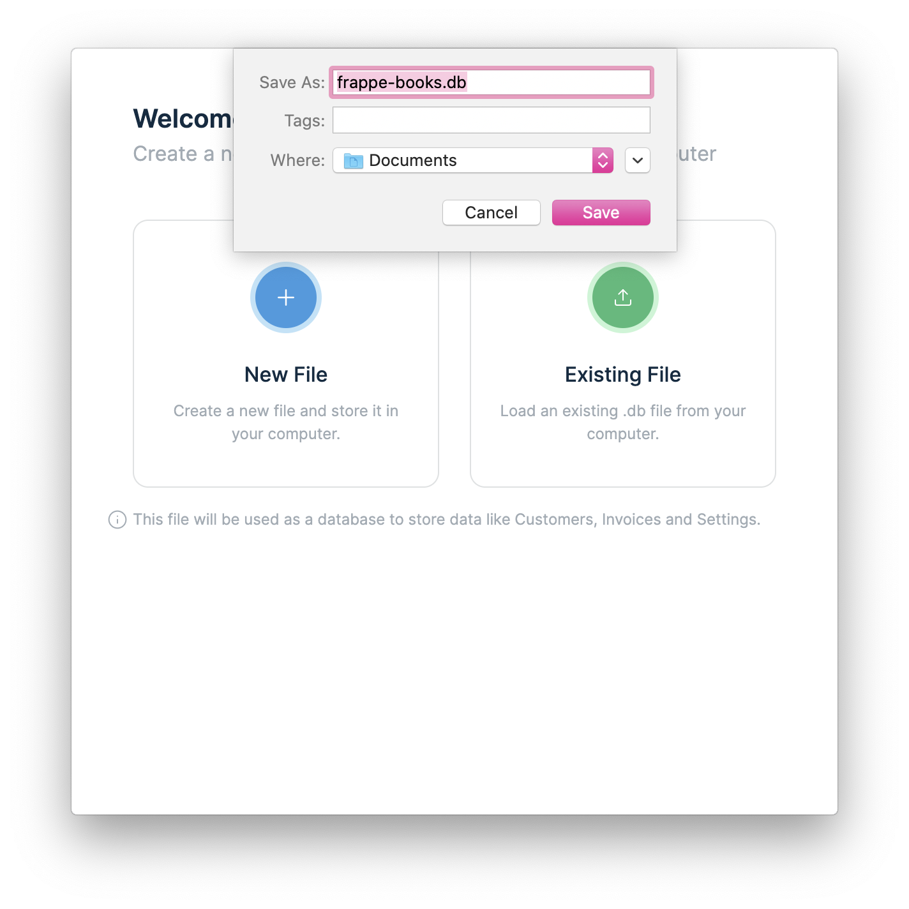

## Select database file

When you open Frappe Books for the first time, you are presented with the
following screen:

### New File

Click on New File if you are using Frappe Books for the first time. Select a
location where you want to save the file, choose a name for your file and click
Save.

### Existing File

Click on Existing File if you have a backup file of Frappe Books already. After
selecting the file, Frappe Books will load the company information and
transactions from it.
