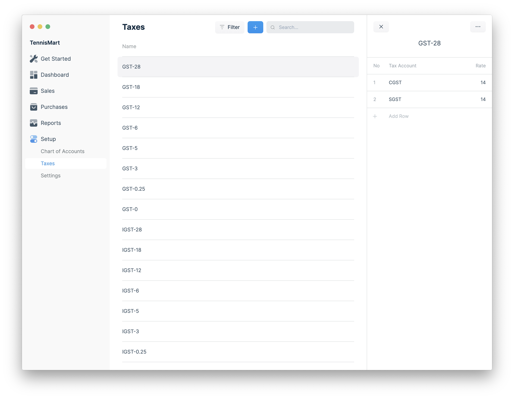

Taxes are managed using templates. A Tax Template contains a list of Tax
Accounts and the corresponding rate. You can create different tax templates for
your items.

## How to create a Tax template?

1. Go to **Setup** > **Taxes**.
1. Click on the blue + button.
1. Enter the name of the Tax template.
1. Click on Add Row.
1. Select the Tax Account and enter the Rate.
1. Repeat Steps 4 and 5 to add more Tax Accounts.
1. Click on Save.
