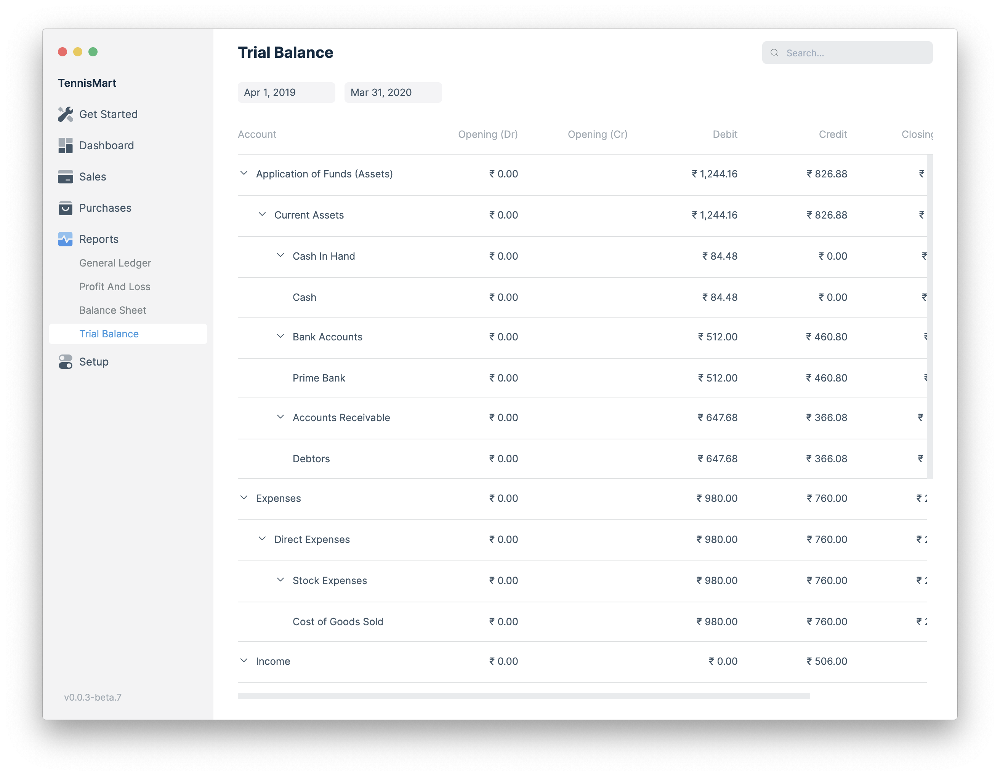

A company prepares a trial balance periodically, usually at the end of every
reporting period. The general purpose of producing a trial balance is to ensure
the entries in a company's bookkeeping system are mathematically correct. The
totals of Debit and Credit columns must be same for any given period, to ensure
the entries are correct.

To view this report, go to **Reports** > **Trial Balance**.

